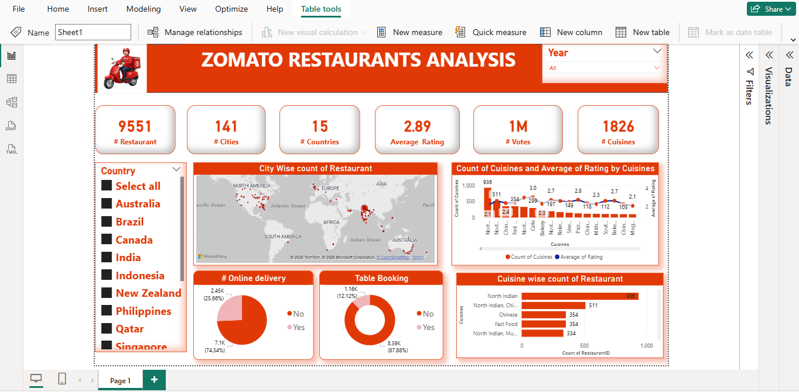

# 🍽️ Zomato Restaurants Analysis Dashboard

## 📊 Project Overview
This Power BI dashboard provides insights into Zomato restaurant data across multiple countries, cities, and cuisines.

## 🔍 Key Insights
- Total Restaurants: 9551
- Cities Covered: 141
- Countries Covered: 15
- Average Rating: 2.89
- Total Votes: 1M+
- Total Cuisines: 1826

## 📌 Features
- City-wise restaurant distribution (Map visualization)
- Cuisine-wise restaurant count and average ratings
- Online delivery analysis
- Table booking availability
- Country-based filtering using slicer

## 🛠️ Tools Used
- Power BI
- Data Cleaning & Transformation
- Data Visualization

## 📷 Dashboard Preview
()

## 📊 Project Overview
This Power BI dashboard provides insights into Zomato restaurant data across multiple countries, cities, and cuisines.

## 🔍 Key Insights
- Total Restaurants: 9551
- Cities Covered: 141
- Countries Covered: 15
- Average Rating: 2.89
- Total Votes: 1M+
- Total Cuisines: 1826

## 📌 Features
- City-wise restaurant distribution (Map visualization)
- Cuisine-wise restaurant count and average ratings
- Online delivery analysis
- Table booking availability
- Country-based filtering using slicer

## 🛠️ Tools Used
- Power BI
- Data Cleaning & Transformation
- Data Visualization

## 🚀 How to Use
1. Download the `.pbix` file
2. Open in Power BI Desktop
3. Interact with filters and visuals

## 📈 Skills Demonstrated
- Data Analysis
- Dashboard Design
- Data Visualization
- Business Insights

---
⭐ If you like this project, don't forget to give it a star!)

## 🚀 How to Use
1. Download the `.pbix` file
2. Open in Power BI Desktop
3. Interact with filters and visuals

## 📈 Skills Demonstrated
- Data Analysis
- Dashboard Design
- Data Visualization
- Business Insights

---
⭐ If you like this project, don't forget to give it a star!
